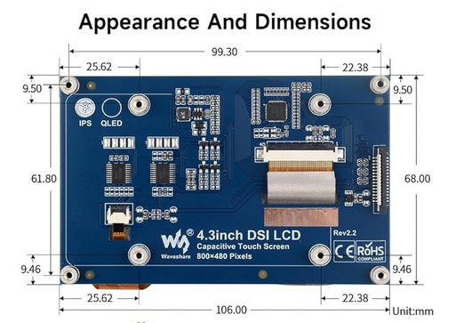
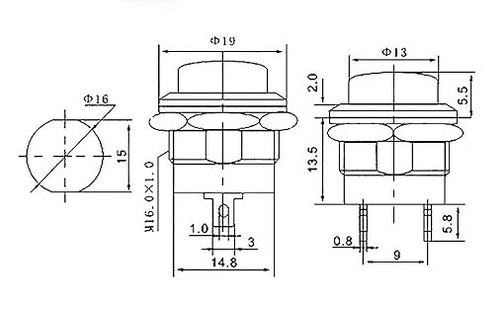

# PiBoy
## About

The PiBoy is a game console, inspired by the Nintendo GameBoy. The project aims to 
recreate the feeling of retro games, with modern technology. It seperates itself from
other projects like RetroPi as it will run any game, instead of a specific selection of games. This is necessary as the project will be used in a future game jam. For this reason, the possibility of quick updates on the games will be crucial.

## Software

TODO: fill out software docs

### Instalation

1. **Install git**

```sudo apt install -y git```

2. **Clone git repository**

```git clone github.com/SimonMeersschaut/PiBoy.git```

3. **Run the setup script**

```
chmod +x ./setup.sh
./setup.sh
```

4. **Run the app**

```
chmod +x ./run.sh
startx /home/pi/run.sh```

## Hardware

The hardware will mostly be 3D printed and soldered. The GPIO pins of the raspberry will be connected to the connections of the buttons.

### Design


### Screen

**Name**: Waveshare 4.3 inch LCD Capacitive Touch Display for Raspberry Pi 4B/3B+/3A+/3B/2B/B+/A+ 800×480 IPS Wide Angle MIPI DSI Interface Screen 

**Distributer**: Amazon

**Link**: https://www.amazon.com.be/-/en/dp/B083Q8YLVP?ref=ppx_yo2ov_dt_b_fed_asin_title

|  Type | Value |
|---|---|
| Brand |  Waveshare |
| Screen size  |  4.3 Inches |
| Resolution | SVGA  |
| Resolution | 800×480 |
| Aspect ratio  |  16:9 |
| Screen surface description  | Matte  |
| Refresh rate  | 60  |
| Power consumption  | 15 Watts  |
| Special feature  | Touchscreen  |
| Connectivity technology  |  DSI |
| Display type  | LCD  |



### Buttons

**Name**: 24pcs 16mm Assorted Red Green Yellow Blue White Black Momentary Push Button Switch 3A 250V AC 2 Pin Auto Reset Mini Round Switch

**Link**: https://www.amazon.com.be/-/en/gp/product/B09MBQSM44/ref=ppx_yo_dt_b_asin_title_o00_s00?ie=UTF8&th=1

| Type | Value |
|------|-------|
| Operation mode | Automatic |
|Current rating |	3 Amps |
|Operating voltage |	250 Volts |
|Contact type |	Normally Open |
|Connector type |	2 Pin |
|Brand 	| Lewttyer |
|Switch type | 	push button, ignition switch |
|Terminal  |	brooches |
|Material |	Alloy Steel |
|Mounting type | Surface Mount |
| Diameter | 19 mm |


